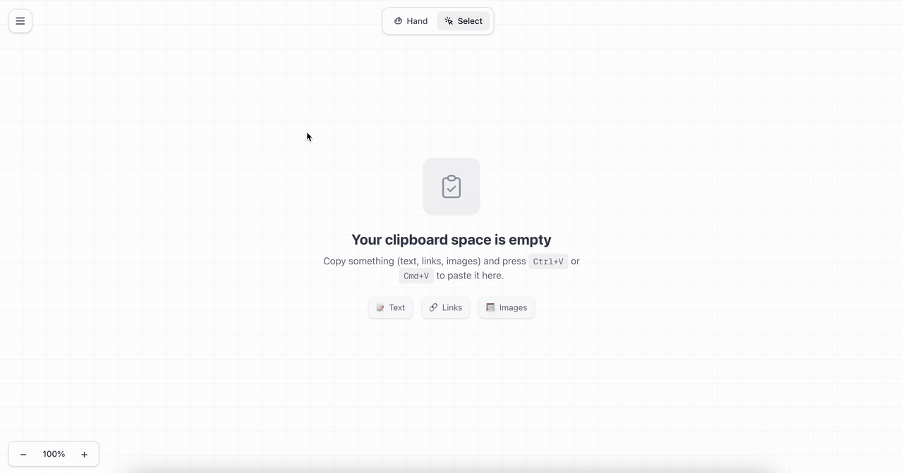
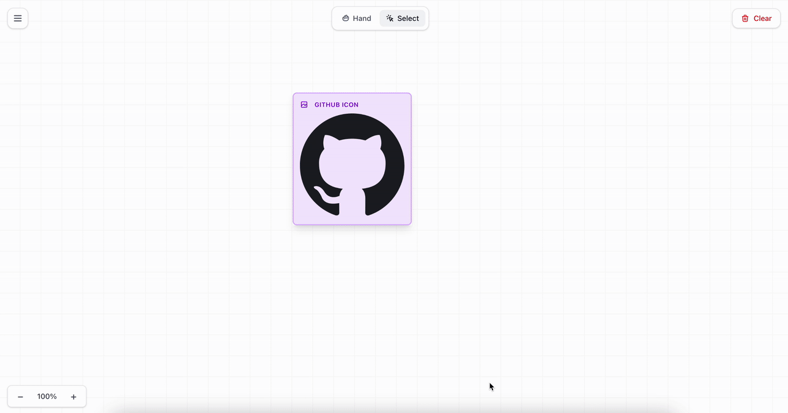

## What is ClipboardSpace?

ClipboardSpace is an infinite, offline-first workspace where everything you copy lives in one visual space. Paste text, links or images and organize them freely on an endless space.

Think of it as a clipboard manager reimagined as a visual workspace — like Excalidraw, but for everything you copy.

### Paste Anything

## Features

- **Paste anything:** Text, links and images — all supported.
- **Infinite space:** Pan and zoom without limits.
- **Visual organization:** Drag, resize, and arrange items however you like.
- **Offline-first:** Everything is stored locally in your browser. No sync, no cloud, no tracking.
- **Search:** Instantly find items by content, type, or name.

### Organize Visually

## How to Use

1. **Copy & Paste:** Copy any content and press `Ctrl/Cmd+V`
2. **Navigate:** Use Hand (H) to pan or Select (V) to interact
3. **Organize:** Right-click nodes for options like copy, move, delete, and rename
4. **Zoom:** Use `Ctrl/Cmd +/-` or pinch on trackpad to zoom

## Privacy First

All your data stays in your browser. Nothing is sent to any server. ClipboardSpace works completely offline, giving you full control over your clipboard data.

## Tech Stack

Built with:
- Next 
- Tailwind
- Browser APIs for offline storage

Hosted on Cloudflare Pages
